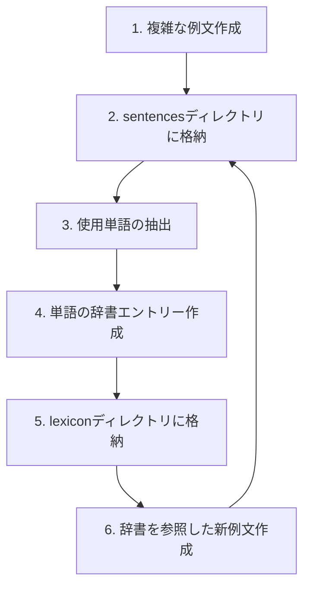

# 1000年後の日本語 辞書整備プロジェクト指示書

## プロジェクト概要

このプロジェクトは「1000年後の日本語」の言語モデルに基づく辞書整備と例文作成を目的としています。1000年後の日本語は現代日本語から屈折語へと変化した言語体系であり、音韻体系、形態変化、統語構造に大きな変化が見られます。

本プロジェクトでは以下の目的を達成します：

1. 言語モデルに沿った一貫性のある例文の作成
2. 使用された単語の辞書エントリー整備
3. 辞書エントリーを参照した新たな例文の作成
4. 上記サイクルの反復による語彙と例文の拡充

この作業を通じて、1000年後の日本語の語彙を体系的に整備し、より複雑な表現を可能にします。

## 作業の基本フロー

辞書整備と例文作成は以下のサイクルで行います：



Eまで完了するたびにユーザーに確認を行い、次のステップに進むかどうかを決定します。例文作成は段階的に行い、最初は基礎的なものから始めて徐々に複雑なものへと進めます。

### 詳細手順

1. **例文作成**
   - 現代日本語で意味の通る例文を作る
     - 例文をつくったあとに、**現代日本語として意味が通り、自然な文であるか**評価すること。
   - 最初は基礎的な例文から始め、徐々に複雑な構文を取り入れる
   - 文化的・社会的コンテキストを考慮した内容とする

2. **文法規則に従った例文作成**
   - booklet_3rd.mdの文法規則に従って、例文を1000年後の日本語に翻訳する

3. **例文の格納**
   - 作成した例文を`sentences`ディレクトリに格納
   - ファイル名は`カテゴリ-レベル.N.md`形式（例: `日常-1.1.md`）

4. **単語の抽出**
   - 例文から未登録の単語を抽出
   - 前舌/後舌、有生/無生など文法的特徴を分析

5. **辞書エントリー作成**
   - 抽出した単語の詳細な辞書エントリーを作成
   - 語源、曲用/活用パターン、用法などを記載
   - 基層語彙は曲用や活用が不規則になる場合があるため、規則変化するかどうか自体も使用頻度を考慮して決定する

6. **辞書エントリーの格納**
   - 作成した辞書エントリーを`lexicon`ディレクトリに格納
   - ファイル名は単語自体を使用（例: `çit.md`）
   - 同じ綴りで異なる品詞を持つ単語（同形異義語）の場合は「見出し語-品詞分類.md」形式を使用
     （例：`amr-adverb.md`「副詞の明日」、`amr-noun.md`「名詞の明日」）

7. **同形異義語の管理**
   - 同じ綴りで異なる品詞を持つ単語の辞書索引での表示：
     - 見出し語自体には品詞ラベルを含めない
     - ファイルリンクのみに品詞ラベルを含める（例：`[**amr**](lexicon/amr-adverb.md)`）
   - 異なる品詞の同形異義語は関連語セクションで相互参照する
   - 例文では品詞の違いを明確にするため、文法情報や用法の違いを注釈に記載する

8. **辞書を参照した新例文作成**
   - 整備された辞書を参照し、より複雑な例文を作成
   - 登録済み単語を積極的に活用

## ファイル構造とフォーマット

### 全体構造

```
ningot/
├── booklet_3rd.md      # 言語モデルの基本文書
├── instruction.md      # 本プロジェクト指示書
├── sentences/          # 例文ディレクトリ
│   ├── 日常-1.1.md   # 例文ファイル
│   └── ...
└── lexicon/            # 辞書エントリーディレクトリ
    ├── çit.md          # 単語エントリー
    └── ...
```

### 例文ファイルフォーマット

例文ファイル（`sentences/カテゴリ-レベル.N.md`）の構造：

```markdown
# 例文ID: YYYYMMDD-N

## 原文
[1000年後の日本語への対訳]

## 現代日本語訳
[現代日本語での例文]

## 形態素解析
[単語ごとの分解と文法情報]

## 使用単語リスト
- 単語1: 文法情報
- 単語2: 文法情報
- ...

## 文法注釈
[使用されている文法構造の説明]
```

### 辞書エントリーフォーマット

辞書エントリー（`lexicon/単語.md`）の構造：

```markdown
# 見出し語: [単語]

## 文法情報
- **類別**: [名詞/動詞/形容詞/副詞/その他]
- **音韻型**: [前舌/後舌]
- **名詞分類**: [有生/無生]（名詞の場合）
- **動詞分類**: [前舌/後舌]（動詞の場合）

## 語源情報
[現代日本語からの変化過程]

## 定義
1. [第一義]
2. [第二義]（複数の意味がある場合）

## 曲用/活用表
[名詞の場合は格変化、動詞の場合は時制・人称変化]

## 例文
1. [例文1]
2. [例文2]

## 関連語
- [同義語/反義語/関連語]

## 備考
[特記事項]
```

## 例文作成ガイドライン

### 複雑度レベル分類

例文は以下の複雑度レベルに分類し、徐々に高度な例文を目指します：

1. **レベル1**: 単文、基本的な名詞と動詞の使用
2. **レベル2**: 複数の句を含む文、形容詞修飾
3. **レベル3**: 複文、関係節の使用
4. **レベル4**: 複雑な従属節、接続表現
5. **レベル5**: 高度な文法要素を組み合わせた複合構造

### 主題カテゴリ

例文の主題は以下のカテゴリから多様に選択します：

- **日常生活**: 挨拶、自己紹介、買い物、天気など
- **社会文化**: 伝統、習慣、社会構造、文化的事象
- **学術思想**: 哲学的概念、科学的説明、抽象的思考
- **技術発展**: 未来技術、コミュニケーション方法、道具
- **自然環境**: 自然現象、地理的特徴、環境変化
- **物語創作**: 短い物語、寓話、描写文

### 文体バリエーション

例文には以下の文体を適宜取り入れます：

- **公式文体**: 敬語接辞必須、定形文末、文体標識「-arat/-aret」
- **標準文体**: 敬語接辞選択的、全人称標識使用
- **口語文体**: 敬語接辞なし、人称標識省略、縮約形多用

## 辞書エントリー作成ガイドライン

### 見出し語選定基準

1. **基本語彙**: 日常生活や基本概念を表す単語を優先
2. **文法的重要性**: 文法的に特徴的な変化を示す単語
3. **使用頻度**: 例文内で繰り返し使用される単語
4. **意味的広がり**: 多義性や比喩的用法を持つ単語
5. **分野別語彙**: 様々な分野の専門用語

### 文法情報記述

1. **音韻情報**: 前舌/後舌型、許容される子音クラスタ
2. **形態情報**: 曲用/活用パターン、不規則変化
3. **統語情報**: 統語的役割、結合制約
4. **意味情報**: 核心的意味、拡張的用法

### 曲用/活用表作成

名詞の曲用表には以下を含めます：
- 8つの基本格（主格、対格、与格、所格、属格、出格、向格、共格）
- 数（単数/複数）
- 定性（不定/定）

動詞の活用表には以下を含めます：
- 時制（現在、過去、未来）
- 人称（1人称、2人称、3人称）と数（単数、複数）
- 主な法（直説法、条件法、命令法など）

### 例文選定

1. **典型的用法**: 単語の基本的な使用を示す例
2. **文法的特徴**: 曲用/活用パターンを例示
3. **意味的広がり**: 多義性や比喩的用法を示す例
4. **コロケーション**: 典型的な共起関係を示す例

## 品質管理と一貫性確保

### 用語統一

- 文法用語は一貫して使用
- 定義の重複や矛盾を避ける
- 一つの概念に対して一つの用語を使用

### 文法規則適用

- booklet_3rd.mdの規則を厳格に遵守
- 規則の例外は明示的に記録
- 新たな規則発見時は文書化

### 相互参照管理

- 関連語の相互参照を徹底
- 例文と辞書エントリー間の参照関係を明確化
- 修正時は関連する全てのエントリーを更新

### 定期的レビュー

- 作成済みの例文と辞書エントリーの定期的見直し
- 一貫性チェック
- 拡充すべき領域の特定
- lexicon_index.mdを用いて、全エントリーの索引を作成し、参照しやすくする

## 今後の展望

1. **語彙拡充**: 基本語彙から専門分野への拡大
2. **例文複雑化**: 単文から複雑な修辞表現まで
3. **文体多様化**: 公式、標準、口語の各文体のバリエーション充実
4. **特殊表現集**: 慣用句、諺、比喩表現の整備
5. **テキスト作成**: 短編物語、対話、説明文など様々なジャンルのテキスト

このプロジェクトを通じて、「1000年後の日本語」という言語モデルの表現力と一貫性を高め、より豊かな言語体系を構築します。
